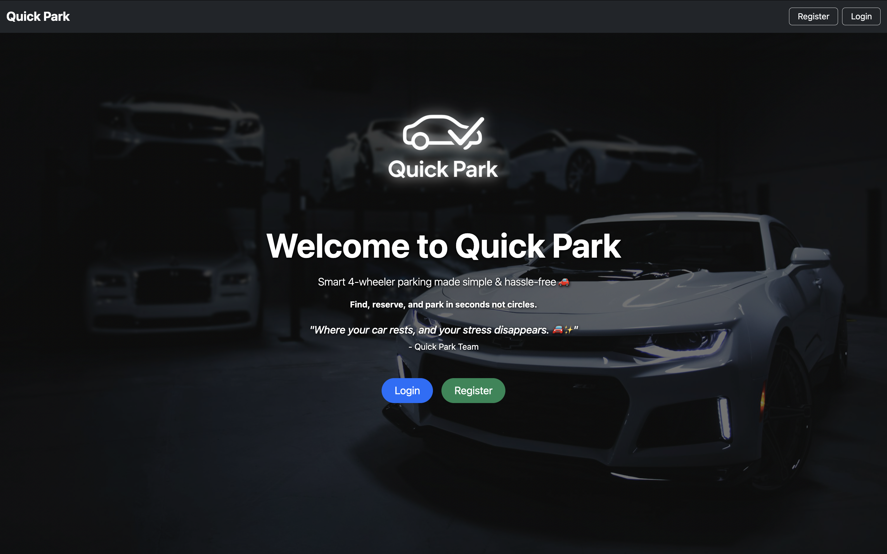
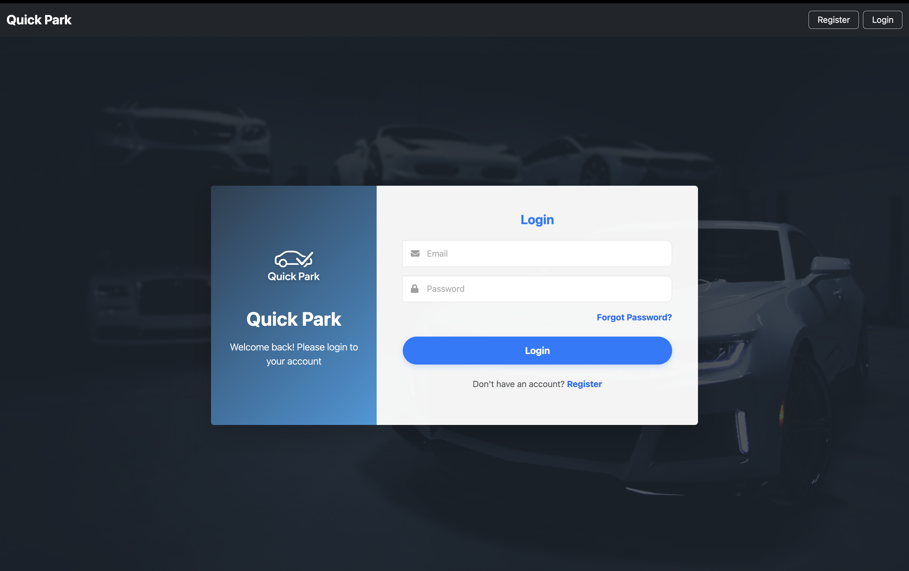
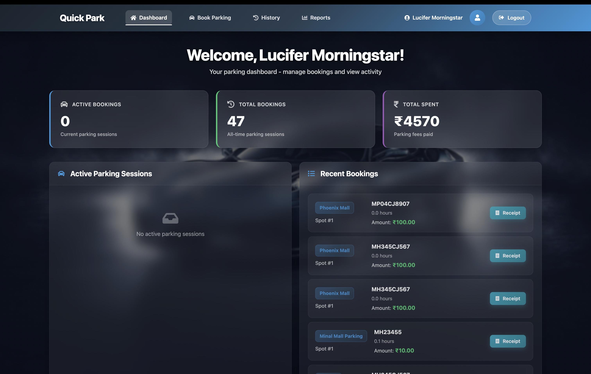
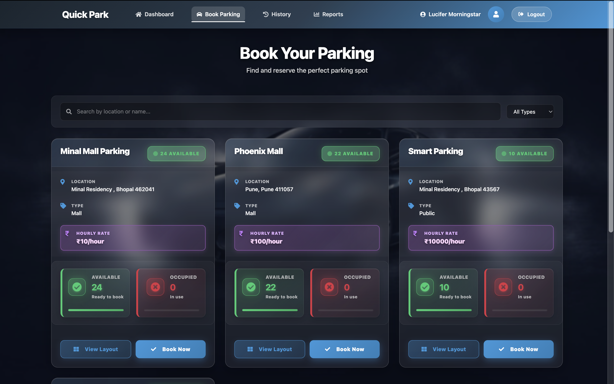
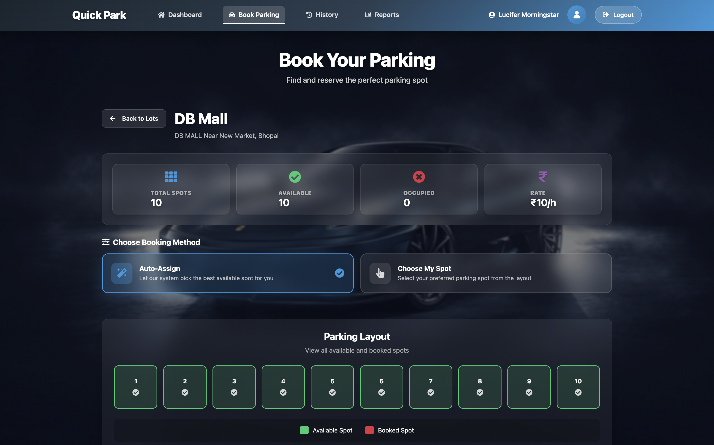
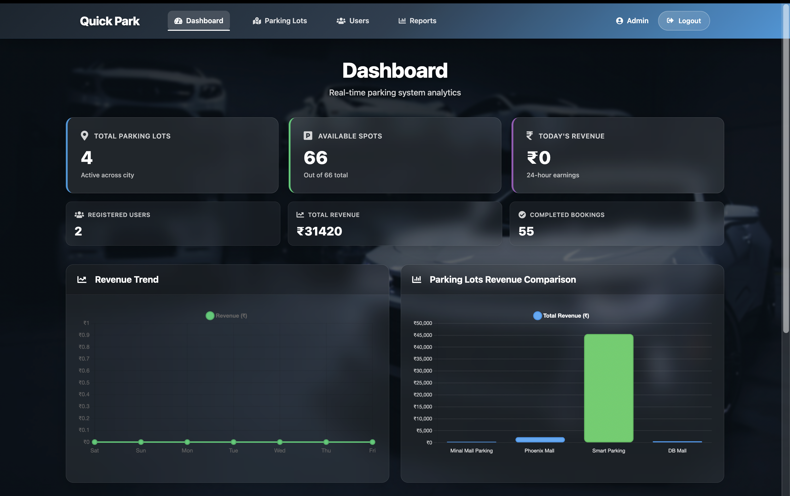
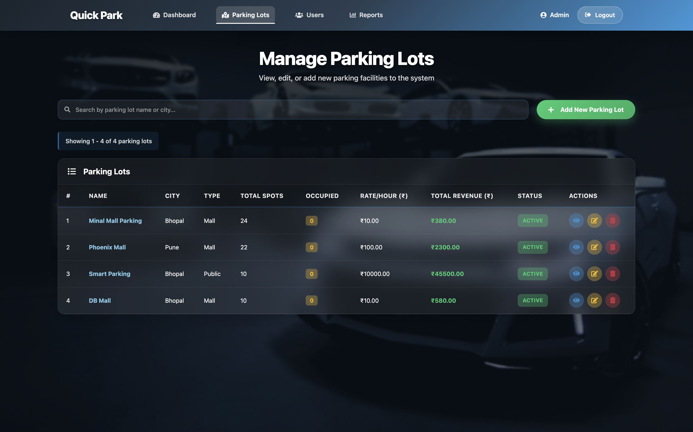
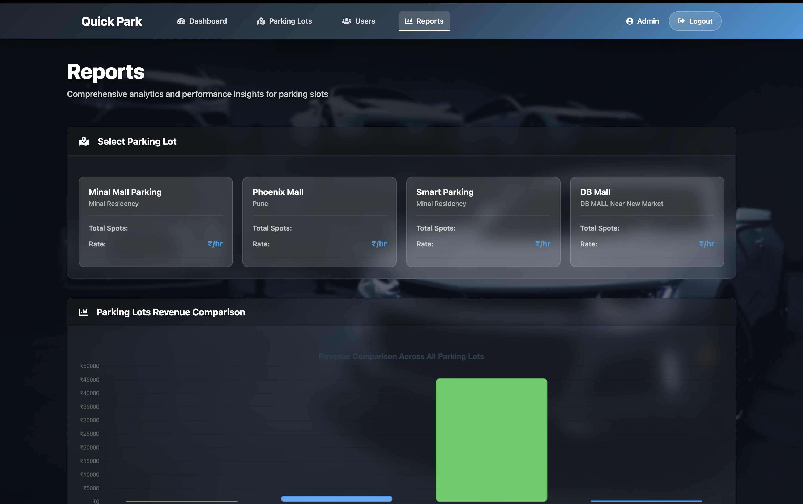
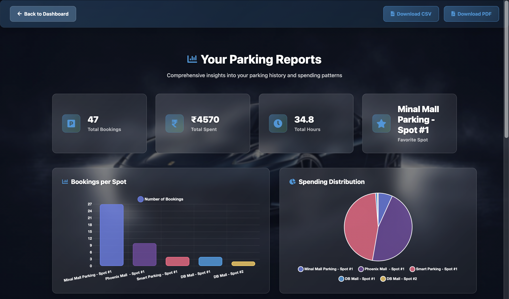

# Quick Park


A modern, full-stack vehicle parking management system designed to streamline parking operations for administrators and provide a seamless booking experience for users.

---

## Overview

Quick Park addresses the inefficiencies of traditional parking management by digitizing the entire workflow from spot discovery to payment reconciliation. The system enables parking lot operators to manage multiple facilities, track real-time occupancy, and generate comprehensive revenue reports. Users benefit from a streamlined booking process with automated confirmations, digital receipts, and detailed parking history.

**Real-World Use Case**: Urban parking facilities, commercial complexes, and residential societies looking to replace manual ticketing with an automated, data-driven parking management solution.

---

## Awards & Recognition

🏆 **Best Course Project Award**  
Certificate of Appreciation for **Best Course Project in Modern Application Development II**  
*IIT Madras BS Degree Program* (Diploma Sept 2025)  
Roll No: 23F2002762  

🔗 [View Full Certificate (PDF)](https://drive.google.com/file/d/11tH0qdzI6fYCOCPydmAen6B1m8f3uiWo/view?usp=sharing)

---

## Features

### Authentication and Security
- JWT-based authentication with configurable token expiration
- Role-based access control (Admin/User)
- OTP-based password reset via email
- Secure password hashing with Werkzeug

### User Features
- Browse available parking lots with real-time spot availability
- **Dual booking mode**: Auto-assign OR manually select your preferred spot
- Book parking spots with vehicle number registration
- Park-out with automatic duration calculation and billing
- View booking history with detailed receipts
- Download parking reports (PDF/CSV)
- Profile management with avatar support
- Email notifications with **QR code** for booking confirmations (scannable for all details)

### Admin Features
- Dashboard with key metrics (total spots, occupancy, revenue, active bookings)
- Full CRUD operations for parking lots
- Real-time spot monitoring with customer details
- User management with booking history
- Comprehensive reporting system
  - Slot-level performance reports
  - Revenue analytics
  - CSV export functionality
- Automated email notifications for new parking lot additions

### Technical Highlights
- Asynchronous task processing with Celery
- Redis-based caching for optimized performance
- Automated email delivery (booking confirmations with QR codes, receipts, monthly reports)
- QR code generation for booking verification
- PDF receipt generation with ReportLab
- Timezone-aware datetime handling (Asia/Kolkata)

---

## Tech Stack

### Frontend
| Technology | Purpose |
|------------|---------|
| Vue.js 3 | Reactive UI framework |
| Vue Router 4 | Client-side routing |
| Axios | HTTP client |
| Bootstrap 5 | UI components and styling |
| Chart.js | Data visualization |
| jsPDF + html2canvas | Client-side PDF generation |

### Backend
| Technology | Purpose |
|------------|---------|
| Flask 2.2 | Web framework |
| Flask-JWT-Extended | JWT authentication |
| Flask-SQLAlchemy | ORM |
| Flask-Mail | Email delivery |
| Flask-Cors | Cross-origin resource sharing |
| Flask-Caching | Response caching |

### Infrastructure
| Technology | Purpose |
|------------|---------|
| SQLite | Database (development) |
| Redis | Caching and session storage |
| Celery | Asynchronous task queue |

---

## System Architecture

```
┌─────────────────┐     ┌─────────────────┐     ┌─────────────────┐
│   Vue.js SPA    │────▶│   Flask API     │────▶│   SQLite DB     │
│   (Port 8080)   │     │   (Port 5000)   │     │                 │
└─────────────────┘     └────────┬────────┘     └─────────────────┘
                                 │
                    ┌────────────┴────────────┐
                    │                         │
              ┌─────▼─────┐           ┌───────▼───────┐
              │   Redis   │           │    Celery     │
              │  (Cache)  │           │   (Workers)   │
              └───────────┘           └───────────────┘
                                             │
                                      ┌──────▼──────┐
                                      │ Mail Server │
                                      └─────────────┘
```

**Data Flow**:
1. User interacts with Vue.js frontend
2. API requests authenticated via JWT tokens
3. Flask processes requests, queries SQLite database
4. Frequently accessed data cached in Redis
5. Long-running tasks (emails, reports) delegated to Celery workers

---

## Screenshots / Demo

### Home Page


### Login Page


### User Dashboard


### Book Parking


### Book Parking Option Selection


### Admin Dashboard


### Parking Lot Management


### Admin Reports


### User Reports


**Live Demo**: [Add deployment URL here]

---

## Installation and Setup

### Prerequisites
- Python 3.8+
- Node.js 16+
- Redis Server
- Git

### Backend Setup

```bash
# Clone the repository
git clone https://github.com/yourusername/vehicle_parking_app_23f2002762.git
cd vehicle_parking_app_23f2002762/backend

# Create virtual environment
python -m venv venv
source venv/bin/activate  # On Windows: venv\Scripts\activate

# Install dependencies
pip install -r Requirements.txt

# Start Redis server (in a separate terminal)
redis-server

# Start Celery worker (in a separate terminal)
celery -A celery_app.celery worker --loglevel=info

# Start Celery beat for scheduled tasks (optional)
celery -A celery_app.celery beat --loglevel=info

# Run the Flask application
python app.py
```

### Frontend Setup

```bash
cd frontend

# Install dependencies
npm install

# Start development server
npm run serve
```

### Environment Variables (Optional)

Create a `.env` file in the backend directory:

```env
SECRET_KEY=your-secret-key
JWT_SECRET_KEY=your-jwt-secret
DATABASE_URL=sqlite:///parking.db
REDIS_URL=redis://localhost:6379/0
MAIL_SERVER=localhost
MAIL_PORT=1025
```

### Default Credentials

| Role | Email | Password |
|------|-------|----------|
| Admin | admin@gmail.com | Admin@1234 |

---

## Usage Guide

### For Users

1. **Register/Login**: Create an account or login with existing credentials
2. **Browse Parking Lots**: View available parking facilities with spot counts and rates
3. **Book a Spot**: Select a lot, enter vehicle number, and confirm booking
4. **Park Out**: End your session to calculate duration and generate receipt
5. **View History**: Access past bookings and download reports

### For Administrators

1. **Monitor Dashboard**: View real-time metrics and occupancy
2. **Manage Parking Lots**: Add, edit, or remove parking facilities
3. **View Spot Details**: Monitor individual spot usage and revenue
4. **Manage Users**: View user details and booking history
5. **Generate Reports**: Export slot-level and revenue reports

---

## API Documentation

### Authentication

#### Register User
```http
POST /api/register
Content-Type: application/json

{
  "fullName": "John Doe",
  "email": "john@example.com",
  "address": "123 Street",
  "password": "SecurePass123"
}
```

#### Login
```http
POST /api/login
Content-Type: application/json

{
  "email": "john@example.com",
  "password": "SecurePass123"
}

Response:
{
  "ok": true,
  "token": "eyJhbGciOiJIUzI1NiIs...",
  "user": { "id": 1, "email": "john@example.com", "role": "user" }
}
```

### Parking Operations

#### Get Available Parking Lots
```http
GET /api/user/parking-lots
Authorization: Bearer <token>
```

#### Create Booking
```http
POST /api/user/bookings
Authorization: Bearer <token>
Content-Type: application/json

{
  "lot_id": 1,
  "vehicle_number": "MH01AB1234"
  "spot_id": 5  // Optional - for manual spot selection
}
```

#### Park Out
```http
POST /api/bookings/park-out
Authorization: Bearer <token>
Content-Type: application/json

{
  "bookingId": 1
}
```

### Admin Endpoints

| Method | Endpoint | Description |
|--------|----------|-------------|
| GET | `/api/admin/metrics` | Dashboard metrics |
| GET | `/api/admin/parking-lots` | List all parking lots |
| POST | `/api/parking-lots` | Create parking lot |
| PUT | `/api/parking-lots/:id` | Update parking lot |
| DELETE | `/api/parking-lots/:id` | Delete parking lot |
| GET | `/api/users/details` | List all users with bookings |
| GET | `/api/admin/reports/slots/:lot_id` | Slot-level reports |

---

## Folder Structure

```
vehicle_parking_app_23f2002762/
├── backend/
│   ├── app.py                 # Main Flask application with all routes
│   ├── models.py              # SQLAlchemy database models
│   ├── config.py              # Application configuration
│   ├── extensions.py          # Flask extensions initialization
│   ├── celery_app.py          # Celery configuration
│   ├── tasks.py               # Async tasks (emails, reports)
│   ├── Requirements.txt       # Python dependencies
│   ├── parking.db             # SQLite database
│   └── templates/             # Email templates
│       ├── booking_confirmation.html
│       ├── receipt_email.html
│       ├── monthly_report.html
│       ├── reminder_email.html
│       └── new_parking_lot.html
│
├── frontend/
│   ├── public/                # Static assets
│   ├── src/
│   │   ├── assets/            # Images and static files
│   │   ├── components/
│   │   │   ├── home/          # Public pages (Login, Register, etc.)
│   │   │   ├── admin/         # Admin dashboard components
│   │   │   ├── BookParking.vue
│   │   │   ├── UserDashboard.vue
│   │   │   ├── UserProfile.vue
│   │   │   ├── UserReports.vue
│   │   │   └── ReceiptView.vue
│   │   ├── router/            # Vue Router configuration
│   │   ├── App.vue            # Root component
│   │   └── main.js            # Application entry point
│   ├── package.json
│   └── vue.config.js
│
└── README.md
```

---

## Key Learnings

### Technical Concepts Implemented
- **JWT Authentication Flow**: Implemented secure token-based auth with role claims and token refresh patterns
- **Real-time Data Synchronization**: Managed concurrent booking state across multiple users
- **Asynchronous Processing**: Offloaded email delivery and report generation to background workers
- **Database Relationships**: Designed normalized schema with proper foreign key constraints and cascading deletes
- **API Design**: Built RESTful endpoints with consistent response structures and error handling

### Engineering Decisions
- **SQLite for Development**: Chose SQLite for portability; architecture supports easy migration to PostgreSQL
- **Celery for Background Tasks**: Ensured non-blocking user experience for email and PDF operations
- **Redis Caching**: Implemented caching on high-frequency endpoints like admin metrics
- **Timezone Handling**: Enforced IST (Asia/Kolkata) throughout for consistent billing calculations

---

## Future Enhancements

- [ ] **Payment Integration**: Razorpay/Stripe for online payments
- [ ] **Mobile Application**: React Native or Flutter companion app
- [ ] **Dynamic Pricing**: Time-based and demand-based rate adjustments
- [ ] **Multi-tenancy**: Support for multiple parking operators
- [ ] **Analytics Dashboard**: Advanced charts with historical trends
- [ ] **Push Notifications**: Real-time alerts for booking updates
- [ ] **PostgreSQL Migration**: Production-ready database setup

---

## Author

**Shubh Ghiya**

- GitHub: [github.com/shubhghiya](https://github.com/morningstar0521)
- LinkedIn: [linkedin.com/in/shubhghiya](https://linkedin.com/in/shubh-g-334a2a281)
- Email: ghiyashubh23@gmail.com

---

*Built with Vue.js and Flask*
