<div align="center">

# 🅿️ Quick Park

**A full-stack parking management platform: users find and book parking spots, admins run their lots from a live dashboard.**

[](https://65-2-59-216.sslip.io)
[](https://drive.google.com/file/d/1jrwlxYofyQpCvyQZR5NuMYucI2GTs8mg/view?usp=sharing)
[](https://drive.google.com/file/d/11tH0qdzI6fYCOCPydmAen6B1m8f3uiWo/view?usp=sharing)


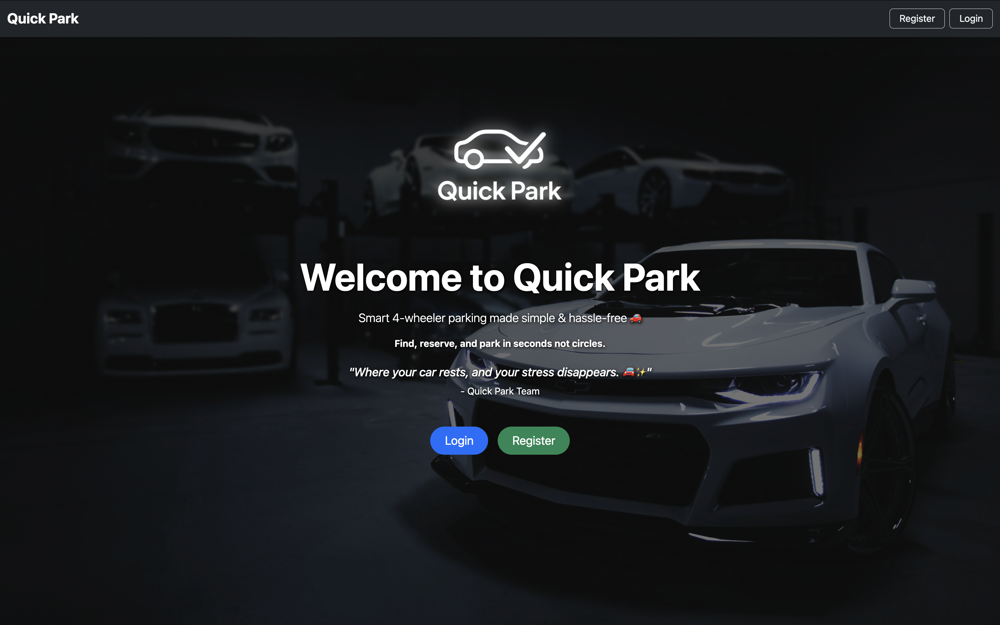

</div>

## 🚀 Try It Live

**URL:** https://65-2-59-216.sslip.io

| Role | Email | Password |
|------|-------|----------|
| Admin | `admin@gmail.com` | `Admin@1234` |
| User | Register a new account on the home page | - |

> This is a shared public demo. Data may be reset at any time.

---

## 📑 Table of Contents

- [The Problem](#-the-problem)
- [Features](#-features)
- [Screenshots](#-screenshots)
- [Tech Stack](#-tech-stack)
- [System Architecture](#-system-architecture)
- [Data Model](#-data-model)
- [Engineering Decisions](#-engineering-decisions)
- [Deployment (AWS)](#-deployment-aws)
- [Run Locally](#-run-locally)
- [API Reference](#-api-reference)
- [Project Structure](#-project-structure)
- [Known Limitations & Roadmap](#-known-limitations--roadmap)
- [Recognition](#-recognition)
- [Author](#-author)

---

## 🎯 The Problem

Many parking facilities (malls, offices, residential societies) still use paper tickets and manual billing. Drivers can't see free spots in advance, and operators have no clear view of occupancy or revenue.

**Quick Park digitizes the full flow:** spot discovery → booking → park-out → automatic billing → receipts and reports.

---

## ✨ Features

### For Users
- **Browse lots** with live free-spot counts and hourly rates
- **Two booking modes:** auto-assign the first free spot, or pick a specific spot from the lot layout
- **Park-out with automatic billing:** duration is calculated and charged per started hour (minimum 1 hour)
- **Booking confirmation email with a QR code** containing the booking details
- **Receipts and history:** view past bookings, download reports as **PDF** or **CSV**
- **Profile management** with avatar support
- **Forgot password** flow using a time-limited **email OTP** (15 minutes)

### For Admins
- **Dashboard:** total spots, occupancy, revenue, active bookings, plus occupancy and revenue charts (Chart.js)
- **Parking lot CRUD:** adding or resizing a lot creates or removes its spots automatically. Spots with an active booking are never removed.
- **Spot-level monitoring:** see who is parked in each spot and since when
- **User management** with each user's booking history
- **Reports:** slot-level performance, lot analytics and CSV exports
- **All users are notified by email** when a new lot is added

### Background Jobs (Celery + Redis)
- **Monthly activity report** emailed to every user on the 1st of each month
- **Evening reminder** at 8 PM for users with bookings the next day

---

## 📸 Screenshots

| User Dashboard | Book Parking |
|:---:|:---:|
| 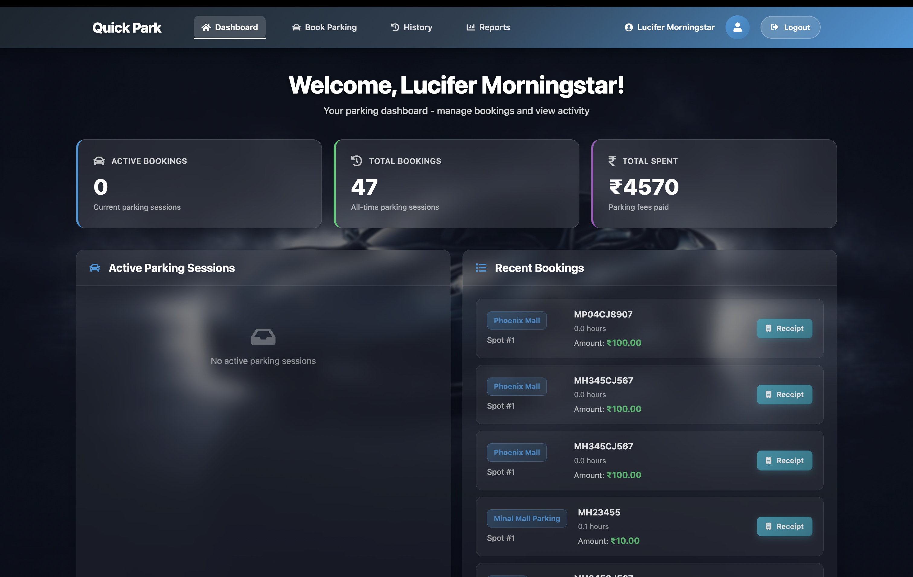 | 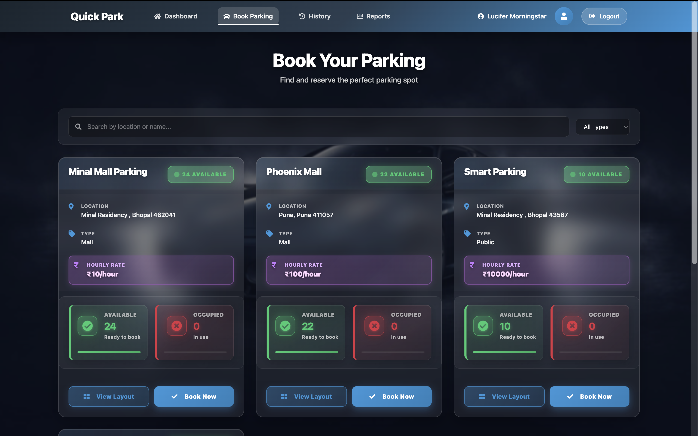 |
| **Spot Selection** | **Admin Dashboard** |
| 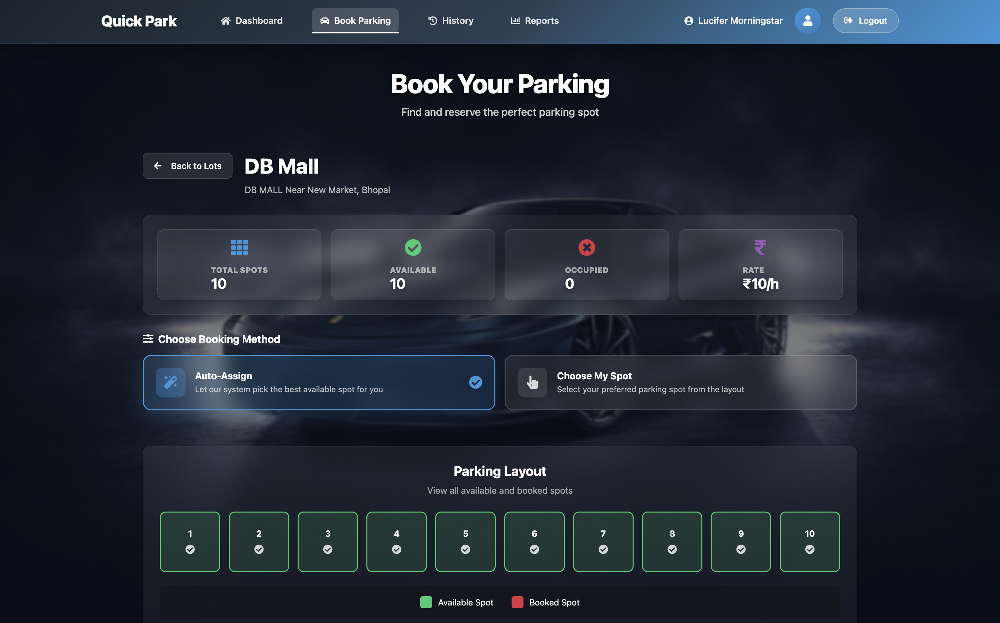 | 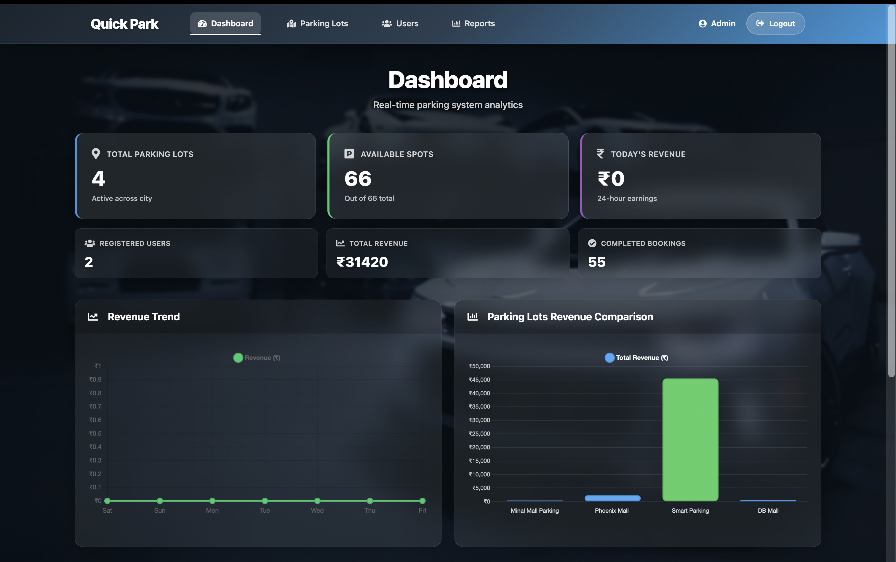 |
| **Manage Parking Lots** | **Admin Reports** |
| 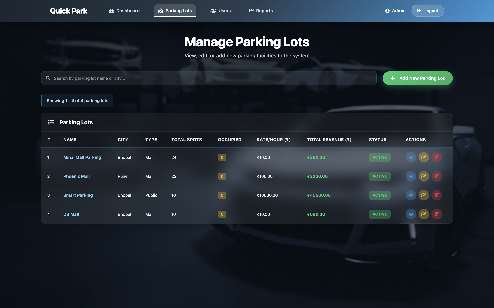 | 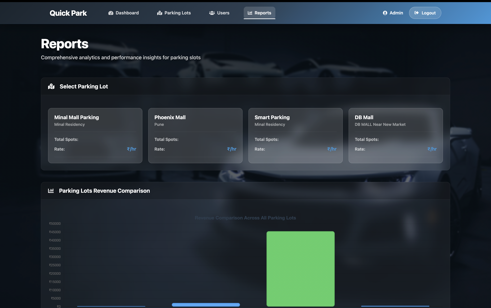 |
| **User Reports** | **Login** |
| 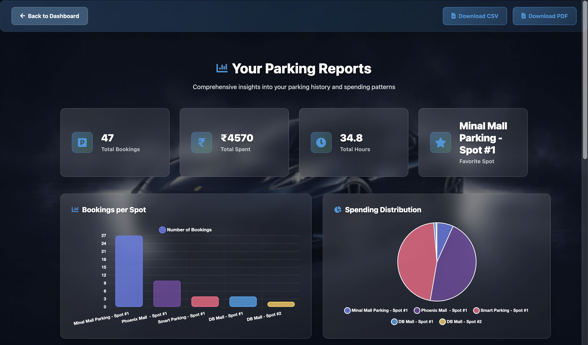 | 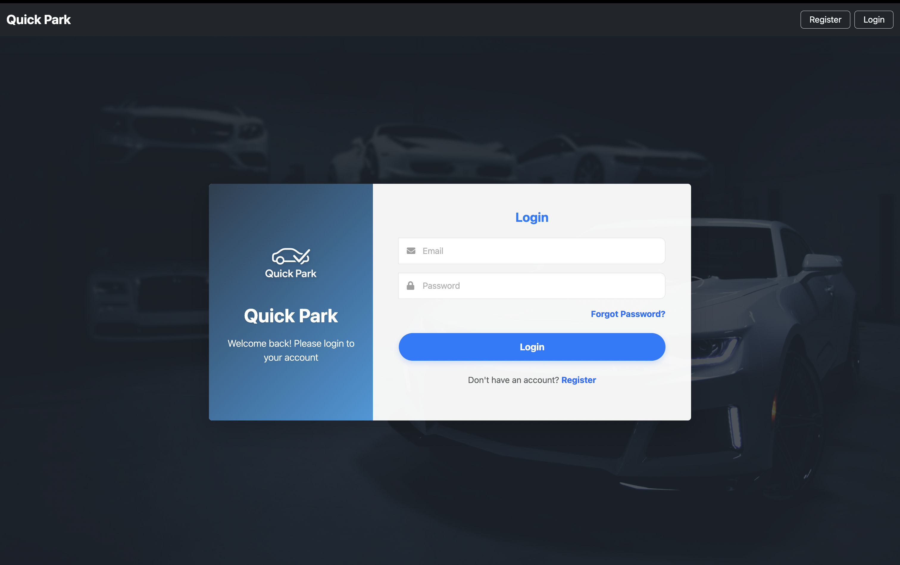 |

---

## 🛠 Tech Stack

| Layer | Technology | Why |
|-------|------------|-----|
| Frontend | Vue 3, Vue Router 4, Bootstrap 5 | Component-based SPA, fast to build responsive UI |
| Charts & Export | Chart.js, jsPDF, html2canvas | Dashboard charts and client-side PDF export |
| Backend | Flask 2.2, Flask-SQLAlchemy | Lightweight REST API with an ORM |
| Auth | Flask-JWT-Extended, Werkzeug hashing | Stateless JWT auth with role claims (admin / user) |
| Background Jobs | Celery + Redis | Scheduled jobs (monthly reports, reminders) outside the request cycle |
| Caching | Flask-Caching (Redis) | Caches the admin metrics endpoint for 30 seconds |
| Email | Flask-Mail, Jinja2 templates, qrcode, ReportLab | HTML emails with QR codes, PDF receipts |
| Database | SQLite | Zero-setup, single-file DB that fits a single-server demo |
| Infrastructure | Docker Compose, Caddy, Gunicorn, AWS EC2 | One-command deploy with automatic HTTPS |

---

## 🏗 System Architecture

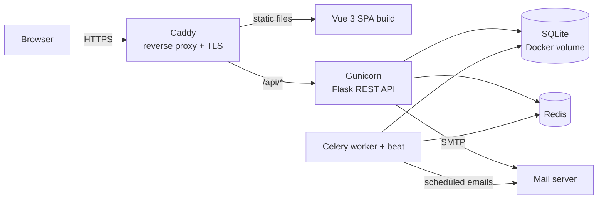
```mermaid
flowchart LR
    U[Browser] -->|HTTPS| C[Caddy<br/>reverse proxy + TLS]
    C -->|static files| V[Vue 3 SPA build]
    C -->|/api/*| G[Gunicorn<br/>Flask REST API]
    G --> DB[(SQLite<br/>Docker volume)]
    G --> R[(Redis)]
    G -->|SMTP| M[Mail server]
    B[Celery worker + beat] --> R
    B --> DB
    B -->|scheduled emails| M
```

**Request flow**
1. Caddy terminates HTTPS and serves the built Vue app.
2. Calls to `/api/*` go to Flask on the same domain, so the browser needs no CORS setup.
3. Flask verifies the JWT and checks the `role` claim on every protected route.
4. Celery beat triggers scheduled jobs. Redis is the message broker, and also the cache.

---

## 🗄 Data Model

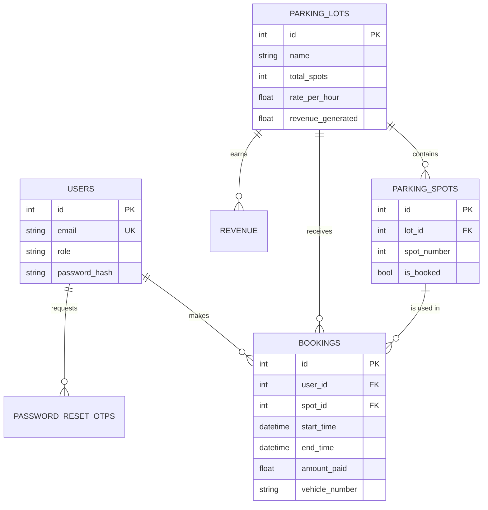
```mermaid
erDiagram
    USERS ||--o{ BOOKINGS : makes
    USERS ||--o{ PASSWORD_RESET_OTPS : requests
    PARKING_LOTS ||--o{ PARKING_SPOTS : contains
    PARKING_LOTS ||--o{ BOOKINGS : receives
    PARKING_SPOTS ||--o{ BOOKINGS : "is used in"
    PARKING_LOTS ||--o{ REVENUE : earns

    USERS {
        int id PK
        string email UK
        string role
        string password_hash
    }
    PARKING_LOTS {
        int id PK
        string name
        int total_spots
        float rate_per_hour
        float revenue_generated
    }
    PARKING_SPOTS {
        int id PK
        int lot_id FK
        int spot_number
        bool is_booked
    }
    BOOKINGS {
        int id PK
        int user_id FK
        int spot_id FK
        datetime start_time
        datetime end_time
        float amount_paid
        string vehicle_number
    }
```

- Deleting a user cascades to their bookings. Deleting a lot cascades to its spots.
- `end_time = NULL` means the booking is still active.

---

## 🧠 Engineering Decisions

| Decision | Reasoning | Trade-off |
|----------|-----------|-----------|
| **Atomic "claim" UPDATEs + partial unique indexes** for bookings | Prevents double booking, double park-out and lost counter updates under parallel requests. Works on SQLite now and PostgreSQL later (`with_for_update` adds row locks there). | Losing requests get a clear 409 "spot just booked" message instead of waiting |
| **JWT with role claims** instead of server sessions | Stateless API, so the frontend and backend can scale or deploy separately | No token revocation; tokens expire after 1 hour |
| **Billing per started hour, minimum 1 hour** | Matches how real parking lots charge; simple for users to understand | A 61-minute stay is billed as 2 hours |
| **All timestamps in IST (Asia/Kolkata)** | Billing durations and email times stay consistent for the target users | Would need UTC storage for multi-region use |
| **Spots generated automatically from `total_spots`** | Admin edits one number instead of managing spots by hand | Shrinking a lot skips spots that still have an active booking |
| **Celery for scheduled jobs** | Monthly reports and reminders run without blocking API requests | Needs Redis and an extra worker process |
| **Same-domain reverse proxy (Caddy)** | Removes CORS issues, one TLS certificate, automatic Let's Encrypt renewal | Single entry point on one server |
| **SQLite in production** | Zero ops for a single-server demo, data stored on a Docker volume | Not suitable for concurrent multi-server writes. PostgreSQL is the next step. |

### Key Learnings
- **Real-time Data Synchronization**: Managed concurrent booking state across multiple users

### Concurrency Control
Booking is a classic race condition: two users see the same free spot and both click **Book**.

| Layer | How it works |
|-------|--------------|
| **Atomic claim** | `UPDATE parking_spots SET is_booked = 1 WHERE id = ? AND is_booked = 0`. The database runs this as one locked step, so only one request gets `rowcount = 1`. Auto-assign retries with the next free spot. |
| **Atomic park-out** | `UPDATE bookings SET end_time = ? WHERE id = ? AND end_time IS NULL`. A double-click on Park Out can't bill twice. |
| **Atomic counters** | `occupied_spots = occupied_spots + 1` in SQL instead of read-modify-write in Python, so no update is lost |
| **DB-level guarantee** | Partial unique indexes: one active booking per spot and per user (`WHERE end_time IS NULL`) |

**Verified with a parallel test** ([`backend/tests/test_concurrency.py`](backend/tests/test_concurrency.py)): 20 users booking the same spot at the same instant → exactly 1 succeeds. 20 users on a 5-spot lot → exactly 5 bookings on 5 different spots. 20 parallel park-outs → billed once.

```bash
docker compose exec backend python tests/test_concurrency.py
```

---

## ☁️ Deployment (AWS)

Deployed on a single **AWS EC2** instance (Ubuntu, Mumbai region) with **Docker Compose**:

| Container | Role |
|-----------|------|
| `web` | Caddy: serves the Vue build, proxies `/api` to Flask, automatic HTTPS (Let's Encrypt) |
| `backend` | Flask API on Gunicorn (1 worker, 4 threads: low memory use and safe with SQLite) |
| `worker` | Celery worker + beat for scheduled jobs |
| `redis` | Celery broker and Flask cache |

**Infrastructure details**
- **Elastic IP** gives the server a fixed public address
- **Security group:** ports 80/443 open to the public, SSH restricted to one IP
- **Multi-stage Dockerfile** for the frontend: Node builds the app, and only the static files ship in the final Caddy image
- **Persistent data:** SQLite and TLS certificates live in Docker volumes, so they survive redeploys
- **Secrets** are loaded from a `.env` file that is never committed

**Deploy / update**
```bash
# One-time server setup (adds swap + installs Docker)
git clone https://github.com/morningstar0521/Quick-Park.git && cd Quick-Park
bash deploy/ec2-setup.sh            # log out and back in afterwards
cp .env.example .env && nano .env   # set DOMAIN, secrets

# Deploy (and every update after a git pull)
docker compose up -d --build
```

---

## 💻 Run Locally

### Option 1: Docker (recommended)
```bash
git clone https://github.com/morningstar0521/Quick-Park.git && cd Quick-Park
cp .env.example .env
# In .env set: DOMAIN=:80  and  CORS_ORIGINS=http://localhost
docker compose up -d --build
```
Open http://localhost

### Option 2: Manual (for development)
**Prerequisites:** Python 3.10+, Node.js 18+, Redis

```bash
# Backend
cd backend
python -m venv venv && source venv/bin/activate   # Windows: venv\Scripts\activate
pip install -r Requirements.txt
python app.py                                     # http://127.0.0.1:5000

# Background jobs (optional, separate terminals)
redis-server
celery -A celery_app.celery worker -B --loglevel=info

# Frontend (new terminal)
cd frontend
npm install
npm run serve                                     # http://127.0.0.1:8080
```
The Vue dev server forwards `/api` calls to Flask, so no extra config is needed.

### Environment Variables

| Variable | Purpose | Default |
|----------|---------|---------|
| `DOMAIN` | Public domain Caddy serves (and gets a certificate for) | - |
| `SECRET_KEY` / `JWT_SECRET_KEY` | Flask and JWT signing keys | dev values |
| `CORS_ORIGINS` | Allowed origins, comma separated | `http://localhost:8080,...` |
| `ADMIN_PASSWORD` | Password of the auto-created admin | `Admin@1234` |
| `DATABASE_URL` | SQLAlchemy database URL | `sqlite:///backend/parking.db` |
| `REDIS_URL` / `CACHE_REDIS_URL` | Celery broker and cache | `redis://localhost:6379/0` and `/1` |
| `MAIL_SERVER`, `MAIL_PORT`, `MAIL_USE_TLS`, `MAIL_USERNAME`, `MAIL_PASSWORD` | SMTP settings (e.g. Gmail with an App Password) | `localhost:1025` |

---

## 📡 API Reference

All protected routes need the header `Authorization: Bearer <token>`.

<details>
<summary><b>Auth</b></summary>

| Method | Endpoint | Description |
|--------|----------|-------------|
| POST | `/api/register` | Create a user account |
| POST | `/api/login` | Returns a JWT with a `role` claim |
| POST | `/api/logout` | Log out |
| GET | `/api/me` | Current user |
| POST | `/api/auth/send-otp` | Email a password-reset OTP |
| POST | `/api/auth/verify-otp` | Verify OTP, returns a reset token |
| POST | `/api/auth/reset-password` | Set a new password |
</details>

<details>
<summary><b>User</b></summary>

| Method | Endpoint | Description |
|--------|----------|-------------|
| GET | `/api/user/parking-lots` | Lots with free-spot counts |
| GET | `/api/user/parking-lots/:id/spots` | Spot layout for manual selection |
| POST | `/api/user/bookings` | Book a spot (`lot_id`, `vehicle_number`, optional `spot_id`) |
| GET | `/api/user/bookings` | My bookings |
| POST | `/api/bookings/park-out` | End a booking and calculate the bill |
| GET | `/api/user/bookings/:id/receipt` | Receipt |
| GET | `/api/user/dashboard` | Dashboard data |
| PUT | `/api/user/profile` | Update profile |
| GET | `/api/user/reports` · `/csv` · `/pdf` | Personal reports and exports |
</details>

<details>
<summary><b>Admin</b></summary>

| Method | Endpoint | Description |
|--------|----------|-------------|
| GET | `/api/admin/metrics` | Dashboard KPIs (cached 30s) |
| GET | `/api/admin/occupancy-data` · `/revenue-data` · `/recent-bookings` | Chart and table data |
| GET/POST | `/api/parking-lots` | List / create lots |
| PUT/DELETE | `/api/parking-lots/:id` | Update / delete a lot |
| GET | `/api/admin/parking-lots/:id/spots` | Spot status with current customer |
| GET | `/api/users/details` | Users with booking history |
| DELETE | `/api/users/:id` | Delete a user |
| GET | `/api/admin/reports/slots/:lot_id` | Slot-level report |
| GET | `/api/admin/reports/lot-analytics/:lot_id` | Lot analytics |
| GET | `/api/admin/reports/lot-csv/:lot_id` | CSV export |
</details>

---

## 📁 Project Structure

```
Quick-Park/
├── backend/
│   ├── app.py              # Flask app factory + all API routes
│   ├── models.py           # SQLAlchemy models
│   ├── config.py           # Environment-based configuration
│   ├── celery_app.py       # Celery + beat schedule
│   ├── tasks.py            # Email jobs, PDF receipts, monthly reports
│   ├── templates/          # Jinja2 email templates
│   ├── Dockerfile
│   └── entrypoint.sh       # Seeds the demo DB on first start
├── frontend/
│   ├── src/
│   │   ├── components/     # home/, admin/ and user views
│   │   ├── router/
│   │   └── main.js
│   ├── Caddyfile           # Reverse proxy + HTTPS
│   └── Dockerfile          # Multi-stage: Node build → Caddy
├── deploy/ec2-setup.sh     # One-time EC2 setup
├── docker-compose.yml
└── .env.example
```

---

## 🧭 Known Limitations & Roadmap

Listed openly, since these are the next things I would fix:

- [ ] **PostgreSQL (AWS RDS)** in place of SQLite, for concurrent writes and managed backups
- [ ] **Move booking and receipt emails to Celery `.delay()`**: today they are sent during the request
- [ ] **CI/CD with GitHub Actions**: run tests and auto-deploy to EC2 on every push
- [ ] **Automated tests** (pytest for the API)
- [ ] **Refresh tokens** and token revocation on logout
- [ ] **Payment gateway** (Razorpay / Stripe)

---

## 🏆 Recognition

**Best Course Project Award: Modern Application Development II**
IIT Madras BS Degree Program (Diploma, Sept 2025)
[View Certificate](https://drive.google.com/file/d/11tH0qdzI6fYCOCPydmAen6B1m8f3uiWo/view?usp=sharing)

---

## 👤 Author

**Shubh Ghiya** · Dual Degree, IIT Madras & UIT RGPV Bhopal

[](https://github.com/morningstar0521)
[](https://linkedin.com/in/shubh-g-334a2a281)
[](mailto:ghiyashubh23@gmail.com)

If you found this project useful, consider giving it a ⭐
